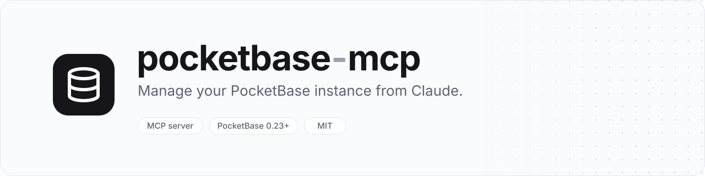

<p align="center">
  
</p>

<p align="center">
  <a href="https://github.com/aymeridev/pocketbase-mcp/actions/workflows/ci.yml"></a>
  <a href="LICENSE"></a>
  
  
</p>

An [MCP](https://modelcontextprotocol.io) server that lets Claude manage a self-hosted [PocketBase](https://pocketbase.io) instance: query and edit records, inspect and change collection schemas, and audit API rules, with a confirmation step before anything is written.

## What you can ask

> *"In the `posts` collection, translate every `content` field from French to English."*

> *"Audit the permissions of the `users` collection."*

> *"Add a `published` bool field to `articles` and set it to true for every article created this year."*

> *"Find an illustration of a house and add it to a new `posts` record as its cover."*

> *"Summarize the PDF attached to invoice `x7k2m9`."*

Claude reads what it needs, shows you a preview of every change, and only writes once you approve.

## Quick start

Requires **Node.js 20+** and a PocketBase **0.23+** instance (tested against 0.40). The server authenticates as a **superuser**.

```bash
git clone https://github.com/aymeridev/pocketbase-mcp.git
cd pocketbase-mcp
npm install
npm run build
```

### Claude Desktop

Open *Settings → Developer → Edit Config* and add:

```json
{
  "mcpServers": {
    "pocketbase": {
      "command": "node",
      "args": ["/absolute/path/to/pocketbase-mcp/dist/index.js"],
      "env": {
        "PB_URL": "https://pb.example.com",
        "PB_SUPERUSER_EMAIL": "admin@example.com",
        "PB_SUPERUSER_PASSWORD": "your-password"
      }
    }
  }
}
```

Restart Claude Desktop, then ask *"Check my PocketBase health"* to verify the connection.

### Claude Code

```bash
claude mcp add pocketbase \
  -e PB_URL=https://pb.example.com \
  -e PB_SUPERUSER_EMAIL=admin@example.com \
  -e PB_SUPERUSER_PASSWORD=your-password \
  -- node /absolute/path/to/pocketbase-mcp/dist/index.js
```

> [!TIP]
> Create a dedicated superuser for the MCP server so you can revoke it independently.

## Safety

Every write goes through three layers:

1. **Read-only mode.** With `PB_READ_ONLY=true`, write tools are not exposed to the model at all.
2. **Client approval.** Write tools carry MCP annotations (`readOnlyHint: false`, `destructiveHint` for deletions and schema changes), so Claude asks before running them.
3. **Two-step confirmation.** The first call to a write tool changes nothing: it returns a preview (field-by-field diff, records affected, fields that would be dropped) and a single-use `confirmationToken`. The operation runs only when the tool is called again with that token **and the exact same arguments**. Tokens expire after 5 minutes.

File tools only touch one local folder (`PB_FILES_DIR`, `~/Downloads/pocketbase-mcp` by default): uploads from a local path must be inside it, and downloads are saved there without overwriting existing files.

Bulk edits go through `pb_batch`, so a translation over 50 records is one preview and one approval, not 50.

## Tools

| Tool | Kind | Description |
| --- | --- | --- |
| `pb_health` | read | Check the instance is reachable and credentials work |
| `pb_list_records` | read | List records with filter, sort, pagination, expand, fields |
| `pb_get_record` | read | Get one record |
| `pb_create_record` | write | Create a record |
| `pb_update_record` | write | Update fields of a record (preview shows before/after) |
| `pb_delete_record` | destructive | Delete a record |
| `pb_batch` | destructive | Many create/update/upsert/delete operations at once |
| `pb_list_collections` | read | Collections with their type and fields |
| `pb_get_collection` | read | Full schema: fields, indexes, rules, auth options |
| `pb_create_collection` | write | Create a collection |
| `pb_update_collection` | destructive | Change a collection (preview lists dropped fields) |
| `pb_delete_collection` | destructive | Delete a collection and its records |
| `pb_get_file_url` | read | URLs of a record's files, with an access token for protected fields and optional thumbnails |
| `pb_download_file` | read | Show an image, read a text file or PDF, or save any file to the local folder |
| `pb_upload_file` | write | Upload files from a local path, a URL or base64, to an existing or new record |
| `pb_delete_file` | destructive | Remove files from a file field (the record is kept) |
| `pb_audit_collection_rules` | read | Rank API rule and field exposure risks by severity |

`pb_download_file` returns png, jpeg, gif and webp images so Claude can see them, and text files and PDFs as text (up to 5 MB). Other formats and larger files are saved to `PB_FILES_DIR` instead.

`pb_batch` runs atomically in one transaction when the PocketBase Batch API is enabled (*Settings → Application → Batch API*) and the operation count fits its limit. Otherwise it runs operations one by one and reports failures individually; the preview tells you which mode applies.

## Configuration

| Variable | Default | Description |
| --- | --- | --- |
| `PB_URL` | required | Base URL of the PocketBase instance. Use the final URL (e.g. `https://`): redirects are followed, but cost an extra request at startup |
| `PB_SUPERUSER_EMAIL` | | Superuser email |
| `PB_SUPERUSER_PASSWORD` | | Superuser password |
| `PB_SUPERUSER_TOKEN` | | Alternative to email/password: a superuser auth token (not refreshed) |
| `PB_READ_ONLY` | `false` | Hide every write tool |
| `PB_REQUIRE_CONFIRMATION` | `true` | Require the two-step confirmation for writes |
| `PB_CONFIRMATION_TTL_SECONDS` | `300` | Lifetime of a confirmation token |
| `PB_FILES_DIR` | `~/Downloads/pocketbase-mcp` | The only local folder file tools read uploads from and save downloads to |

## Development

```bash
npm run dev              # run from source with tsx
npm run typecheck
npm run test:unit

# integration tests against a throwaway PocketBase on :8090
scripts/test-pocketbase.sh
PB_TEST_URL=http://127.0.0.1:8090 PB_TEST_EMAIL=admin@example.com PB_TEST_PASSWORD=password123456 npm run test:integration
```

## License

[MIT](LICENSE)
